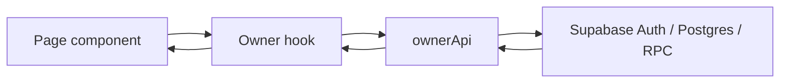

# File Structure

The repository has two main parts: the React application and Supabase Edge Functions.

```text
Customer-Credit-Ledger-Management-System/
├── cclms_react/
│   ├── src/
│   │   ├── App.jsx                 # Routes and role guards
│   │   ├── main.jsx                # React entry point
│   │   ├── components/
│   │   │   ├── Modules/
│   │   │   │   ├── Admin/           # Admin dashboard, owners, logs, landing
│   │   │   │   ├── Login/           # Login and password recovery
│   │   │   │   ├── LandingPage/     # Public landing page
│   │   │   │   └── StoreOwner/      # Owner dashboard and store workflows
│   │   │   ├── ui/                  # Shared shadcn/Radix UI components
│   │   │   ├── owner/               # Owner-specific shared components
│   │   │   ├── app-sidebar.jsx      # Admin navigation
│   │   │   └── owner-sidebar.jsx    # Owner navigation
│   │   ├── hooks/                   # Data-loading and mutation hooks
│   │   ├── lib/
│   │   │   ├── api/owner.js         # Owner data boundary
│   │   │   ├── schemas/             # Zod validation schemas
│   │   │   ├── types/               # JSDoc-oriented shared shapes
│   │   │   ├── mock/                # Local mock adapters
│   │   │   ├── supabase.js          # Browser Supabase client
│   │   │   └── utils.js              # Shared helpers
│   │   ├── App.css
│   │   └── index.css
│   ├── public/                      # Static files
│   ├── docs/                        # Database and integration notes
│   ├── package.json
│   ├── vite.config.js
│   └── index.html
├── supabase/
│   ├── account-theme-and-ledger-security.sql
│   ├── owner-account-deactivation.sql
│   ├── password-reset-otp.sql
│   ├── functions/
│   │   ├── create-store-owner/
│   │   ├── update-store-owner/
│   │   ├── delete-store-owner/
│   │   ├── smart-action/
│   │   └── _shared/cors.ts
│   └── deno.json
├── API_ENDPOINTS.md
├── FILE_STRUCTURE.md
├── SCALABILITY.md
├── SECURITY.md
├── SYSTEM_ARCHITECTURE.md
├── UI_DESIGN.md
└── README.md
```

The canonical project entry point is the root `README.md`. The React app does not contain a second README.

## Where to Make Changes

| Change                           | Primary location                                                      |
| -------------------------------- | --------------------------------------------------------------------- |
| Add or change a route            | `cclms_react/src/App.jsx`                                             |
| Change an owner page             | `cclms_react/src/components/Modules/StoreOwner/`                      |
| Change admin owner management    | `cclms_react/src/components/Modules/Admin/` and `supabase/functions/` |
| Add an owner data operation      | `cclms_react/src/lib/api/owner.js`                                    |
| Change loading or mutation state | `cclms_react/src/hooks/`                                              |
| Change database security         | Supabase SQL migrations and RLS policies                              |
| Change shared visual controls    | `cclms_react/src/components/ui/`                                      |
| Change global styling            | `cclms_react/src/App.css` or `src/index.css`                          |

## Data Boundary

Pages call hooks. Hooks call `ownerApi`. `ownerApi` calls Supabase. Keep this direction so database field names and response mapping stay in one place.


