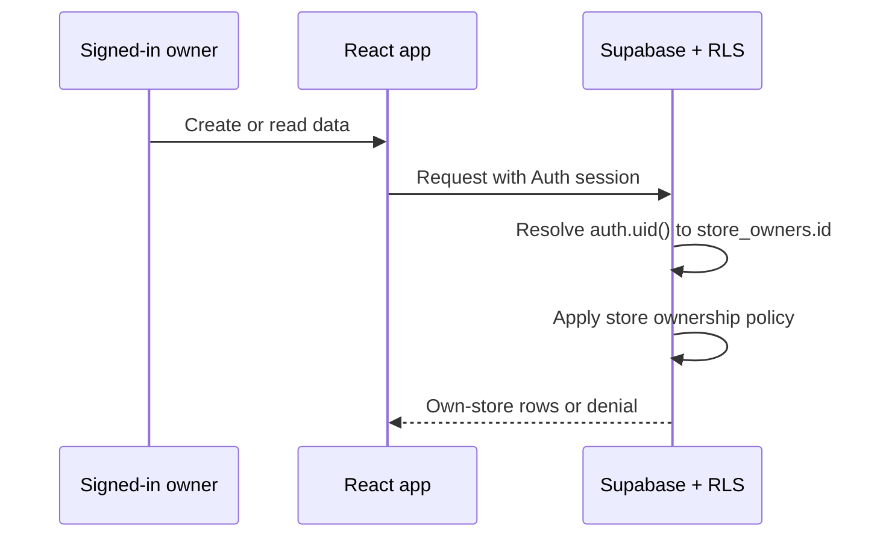

# Security

Security is enforced in layers. Route guards improve the user experience, but Supabase Auth, RLS, and server-side validation are the real protection.

## Authentication and Roles

- Supabase Auth manages login sessions.
- `profiles.role` contains `admin` or `owner`.
- `AdminRoute` allows only admin profiles.
- `OwnerRoute` allows only owner profiles.
- Edge Functions verify the bearer token and then verify the caller's admin role.
- Signing out must invalidate the current session.

## Tenant Isolation

Every owner-owned row must be connected to `store_owners.id` and protected by RLS. The store is looked up from `auth.uid()`; the browser must not be trusted to choose another store.

Apply the ownership rule to `select`, `insert`, `update`, and `delete` policies for:

- `products`
- `customers`
- `credit_entries`
- `credit_entry_items`
- `payments`

Views such as `owner_customer_balances` must preserve the same ownership boundary, for example with `security_invoker = true`.

## Sensitive Credentials

- Browser code may use `VITE_SUPABASE_URL` and `VITE_SUPABASE_PUBLISHABLE_KEY`.
- `SUPABASE_SERVICE_ROLE_KEY` belongs only in Supabase Edge Function secrets.
- Never commit `.env.local`, access tokens, passwords, or service-role keys.
- Do not log passwords, tokens, or full authorization headers.
- Avoid logging customer data unless it is required for a controlled debugging session.

## Validation and Data Integrity

- Validate form input with the existing Zod schemas before submission.
- Validate again in database functions and Edge Functions; client validation is not a security boundary.
- Credit creation must verify the customer and product belong to the same store.
- Payment creation must verify the customer belongs to the current store and the amount is positive.
- Use database constraints for positive prices, quantities, and payment amounts.
- Use atomic RPCs for credit entries and their item rows.
- Keep customer codes database-generated and protected by a unique constraint.

## Admin Actions

Admin owner creation, update, and deletion run in Edge Functions because they use privileged Auth operations. Each action should:

1. Verify the caller's access token.
2. Verify `profiles.role = 'admin'`.
3. Validate required fields and target records.
4. Write an `admin_logs` record where applicable.
5. Avoid allowing an admin to edit or delete the current admin account through owner management.

## Deployment Checklist

- Confirm RLS is enabled on every owner-owned table.
- Confirm production environment variables use the publishable key only in the browser.
- Confirm Edge Function secrets are configured separately.
- Review Storage bucket policies for product images.
- Test admin, owner, unauthenticated, and cross-store requests.
- Review Supabase Auth, database, function, and Storage logs after deployment.
