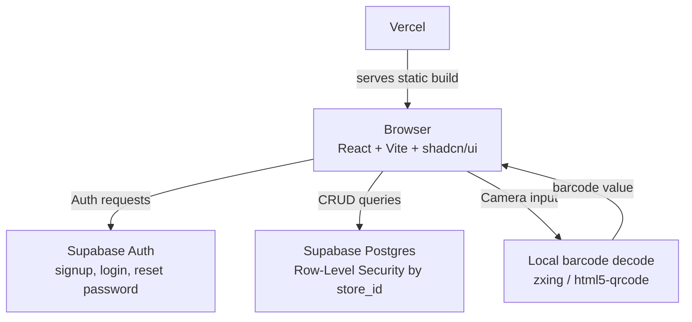
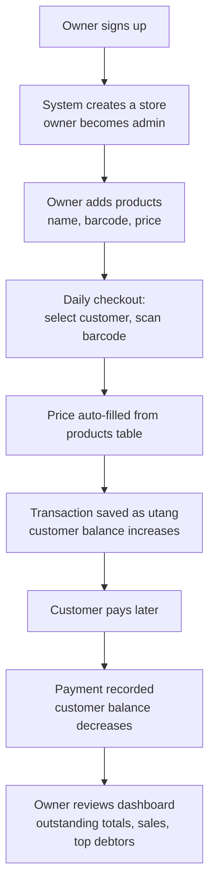
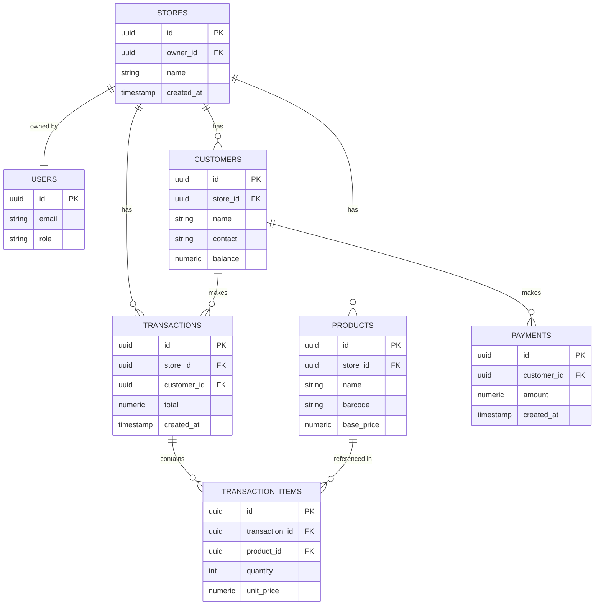
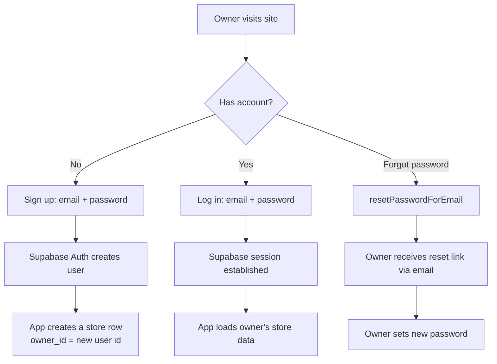

# System Architecture — Sari-Sari (Customer Credit Ledger Management System)

**Model:** Single-owner store. No branches, no staff role. The owner signs
up, and that same account manages products, customers, checkout, and
payments.

---

## 1. Tech Stack

| Layer | Technology | Notes |
|---|---|---|
| Frontend framework | React + Vite | SPA, no SSR |
| UI components | shadcn/ui | Radix + Tailwind, copy-in components |
| Styling | Tailwind CSS | Installed as part of shadcn init |
| Icons | lucide-react | Ships with shadcn init |
| Notifications | sonner | Toasts for add/edit/delete actions |
| Forms & validation | react-hook-form + zod | Pairs with shadcn Form component |
| Backend | Supabase | Postgres database, Auth, Row-Level Security |
| Barcode scanning | @zxing/browser or html5-qrcode | Local camera decoding, no external API |
| Hosting | Vercel | Static SPA build, connected to GitHub for auto-deploy |

---

## 2. Architecture Diagram



**How it fits together:**
- **Vercel** builds and serves the compiled React app. Because it's a
  single-page app, `vercel.json` must include a rewrite so client-side
  routes don't 404 on refresh:
  ```json
  { "rewrites": [{ "source": "/(.*)", "destination": "/index.html" }] }
  ```
- **Supabase Auth** handles signup, login, and password reset — no custom
  auth backend needed.
- **Supabase Postgres** stores all app data, scoped per store using
  Row-Level Security so one owner never sees another owner's data.
- **Barcode scanning** happens entirely in the browser via the device
  camera. It only reads a barcode string and looks it up in your own
  `products` table — no external product-database API is called.

---

## 3. System Flow



---

## 4. Database Schema (simplified, single-owner)



No `branches` table, no `branch_id` anywhere, no `invites` table — a
single `store_id` is the only scoping key used across Row-Level Security
policies.

**Example RLS policy pattern (products table):**
```sql
create policy "Owners can only see their own products"
on products for select
using (store_id = (select id from stores where owner_id = auth.uid()));
```

---

## 5. Auth Flow



---

## 6. Admin Features

**Dashboard**
- Outstanding total — total utang balance
- Today's sales
- Total customers
- Top debtors — customers with the highest unpaid balance
- Sales trend — last 7–30 days
- Recent activity — latest transactions and payments

**Other features**
- Products — add/edit product catalog (name, barcode, base price)
- Customers — view all customer accounts and balances
- Checkout — scan barcode, select/add customer, save as utang
- Ledger — full history of utang entries
- Payments — record and view payment history
- Reports — sales and outstanding balance summaries
- Store settings — store name/branding, account settings, password change

---

## 7. Suggested Folder Structure

```
src/
├── components/
│   ├── ui/              # shadcn components (generated)
│   ├── AdminSidebar.jsx
│   ├── AdminDashboard.jsx
│   ├── ProductsPage.jsx
│   ├── CustomersPage.jsx
│   ├── CheckoutPage.jsx
│   ├── LedgerPage.jsx
│   ├── PaymentsPage.jsx
│   ├── ReportsPage.jsx
│   └── SettingsPage.jsx
├── lib/
│   ├── supabaseClient.js
│   └── utils.js          # e.g. peso formatter
├── hooks/
│   └── useAuth.js
├── routes/
│   └── AppRoutes.jsx
├── App.jsx
└── main.jsx
```

---

## 8. Deployment

1. Push repo to GitHub.
2. Connect the repo to a new Vercel project.
3. Set environment variables in Vercel: `VITE_SUPABASE_URL`,
   `VITE_SUPABASE_ANON_KEY`.
4. Add `vercel.json` rewrite rule (see Section 2) for SPA routing.
5. Every push to the main branch auto-deploys.