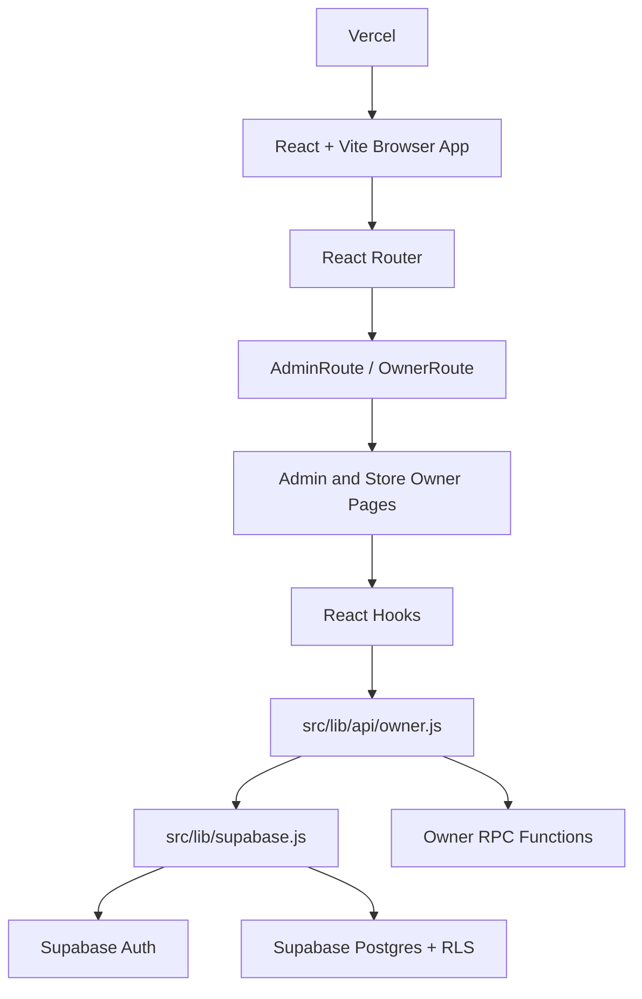
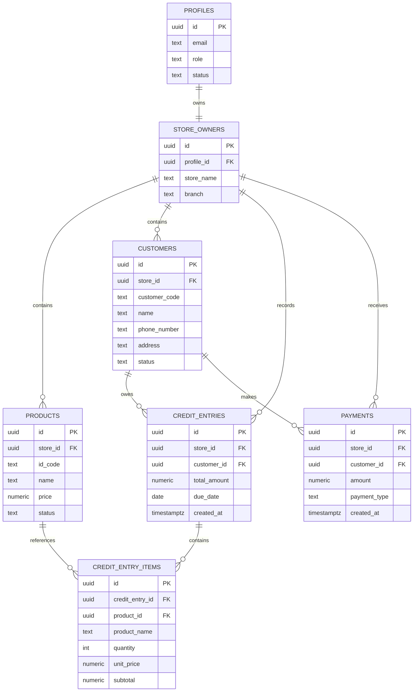

# System Architecture — Sari-Sari

Customer Credit Ledger Management System (CCLMS)

**Model:** Each store owner manages one store. Admin users manage owner accounts. There is no staff role, branch model, or external product-data integration.

## 1. Tech Stack

| Layer | Technology | Notes |
|---|---|---|
| Frontend | React + Vite | JavaScript/JSX SPA |
| Routing | React Router DOM | Admin and Owner route trees with role guards |
| UI | shadcn/ui, Radix, Tailwind CSS | JSX components in `src/components/ui` |
| Icons | lucide-react | Existing project icon library |
| Notifications | Sonner | CRUD, payment, and export feedback |
| Forms | react-hook-form + Zod | Client-side validation |
| Client cache | TanStack Query | Owner profile query and cache updates |
| Charts | Recharts | Owner dashboard charts |
| Backend | Supabase | Auth, Postgres, RLS, and RPC functions |
| Hosting | Vercel | Static SPA deployment |

## 2. Architecture Diagram



The UI does not place Supabase queries in every component. Owner business data goes through `src/lib/api/owner.js`, which maps database fields into the camelCase shapes expected by the JSX pages.

## 3. Authentication and Route Guards

1. Supabase Auth establishes the browser session.
2. Login reads the user's `profiles.role`.
3. Admin users navigate to `/admin`.
4. Owner users navigate to `/owner`.
5. `AdminRoute` and `OwnerRoute` query `profiles` before rendering protected layouts.
6. `ownerApi` resolves the authenticated user's `store_owners.id` before owner inserts.
7. Supabase RLS remains the final security boundary; route guards alone are not database security.

## 4. Application Routes

### Admin Routes

- `/admin` — Admin dashboard
- `/admin/owners` — Store owner management
- `/admin/logs` — Administrative activity logs
- `/admin/landing` — Landing page management

### Store Owner Routes

- `/owner` — Owner dashboard
- `/owner/profile` — Owner profile UI, currently using a separate mock profile adapter
- `/owner/credits` — Credit ledger, customer balances, and payments
- `/owner/products` — Product CRUD and status management
- `/owner/transactions` — Transaction history and Excel export
- `/owner/customers` — Customer CRUD and balance display

## 5. Database Model



The current system does not use separate `stores`, `transactions`, or `transaction_items` tables. Credit transactions are stored in `credit_entries` and `credit_entry_items`. The `owner_customer_balances` view calculates:

```text
customer credit total - customer payment total = current balance
```

Customer codes are database-generated in the format `CUST-XXXXXX` using a PostgreSQL default function and a unique constraint. React does not insert or preview the final customer code.

## 6. Owner Data Flow

### Products

`ProductManagement.jsx` uses `use-owner-products.js`, which calls:

- `ownerApi.listProducts()`
- `ownerApi.createProduct()`
- `ownerApi.updateProduct()`
- `ownerApi.deleteProduct()`
- `ownerApi.toggleProductStatus()`

These methods query the `products` table and respect RLS.

### Customers

`CutomerManagement.jsx` uses `use-owner-customers.js`, which calls:

- `ownerApi.listCustomers()` from `owner_customer_balances`
- `ownerApi.createCustomer()` without inserting `customer_code`
- `ownerApi.updateCustomer()`
- `ownerApi.deleteCustomer()`

The displayed balance comes from the database view.

### Credit and Payments

`CreditTab.jsx` uses `use-owner-credits.js`, which loads:

- Customers
- Products
- Credit entries and credit entry items
- Payments

Credit creation calls the RPC:

```text
create_credit_entry
```

with:

```text
p_customer_id
p_product_id
p_quantity
p_due_date
```

Payment creation calls the RPC:

```text
create_payment
```

with:

```text
p_customer_id
p_amount
p_payment_type
```

The RPCs should validate ownership, product/customer relationships, balance limits, and atomic writes.

### Dashboard

`OwnerDashboard.jsx` uses `ownerApi.getDashboard()`, which calls these RPCs in parallel:

- `owner_dashboard_totals`
- `owner_credit_ranking`
- `owner_monthly_credit_summary`

The API normalizes the results into dashboard totals, ranking rows, and monthly credit/payment chart data.

### Transactions

`TransactionHistory.jsx` uses `ownerApi.listTransactions()` to read real `credit_entries` with related customers and `credit_entry_items`. Search and date filtering happen on the returned data. Excel export uses the complete filtered dataset, not only the current page.

## 7. Row Level Security

RLS must remain enabled on:

- `products`
- `customers`
- `credit_entries`
- `credit_entry_items`
- `payments`

Policies must scope rows through the authenticated user's `store_owners.id`. The client must never be trusted to choose another owner's `store_id`.

Example policy pattern:

```sql
create policy "Owners can read their own products"
on public.products for select to authenticated
using (
  store_id = (
    select id
    from public.store_owners
    where profile_id = auth.uid()
  )
);
```

The same ownership rule must apply to inserts, updates, deletes, and child records. The Supabase service-role key must never be used in browser code.

## 8. Environment Variables

The current browser client reads:

```env
VITE_SUPABASE_URL=your-supabase-project-url
VITE_SUPABASE_PUBLISHABLE_KEY=your-supabase-publishable-key
```

Use these names in local `.env.local` and Vercel environment settings. Do not commit secret values.

## 9. Implemented Folder Structure

```text
cclms_react/src/
├── App.jsx
├── components/
│   ├── Modules/Admin/
│   ├── Modules/StoreOwner/
│   ├── owner/
│   ├── owner-nav-user.jsx
│   ├── owner-sidebar.jsx
│   └── ui/
├── hooks/
│   ├── use-owner-credits.js
│   ├── use-owner-customers.js
│   ├── use-owner-dashboard.js
│   ├── use-owner-products.js
│   └── use-owner-transactions.js
├── lib/
│   ├── api/owner.js
│   ├── schemas/owner.js
│   ├── supabase.js
│   └── utils.js
└── main.jsx
```

The project uses JavaScript and JSX only. Shared data shapes are documented with JSDoc rather than TypeScript interfaces.

## 10. Deployment

1. Push the repository to GitHub.
2. Connect the repository to Vercel.
3. Configure `VITE_SUPABASE_URL` and `VITE_SUPABASE_PUBLISHABLE_KEY` in Vercel.
4. Configure the SPA rewrite to send application routes to `index.html`.
5. Every push to the deployment branch can trigger a new Vercel deployment.
6. Monitor Supabase free-tier database, bandwidth, Auth, and function limits.

For complete table definitions, indexes, RLS guidance, and migration notes, see:

- `cclms_react/docs/database-setup.md`
- `cclms_react/docs/owner-supabase-integration.md`
