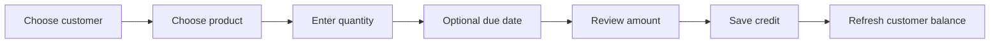

# UI Design

CCLMS is a work-focused ledger application. The interface should help store owners record credit quickly, see who owes money, and manage products without unnecessary navigation.

## Visual Direction

- Use a calm, high-contrast layout with clear hierarchy.
- Keep the sidebar for primary navigation and the content area for one active workflow.
- Use compact tables for repeated business data and cards only for summaries or focused actions.
- Use `lucide-react` icons in buttons and tooltips for unfamiliar icon-only controls.
- Use `sonner` for success and error feedback after mutations.
- Keep destructive actions visually distinct and require confirmation when data is removed.
- Use the existing Geist font setup and shared UI components rather than introducing a second visual system.

## Main Experiences

### Public and Login

- `/` presents the public landing page.
- `/login` provides email/password authentication.
- Password recovery is available through the Forgot Password module.
- Authentication errors should be short, readable, and actionable.

### Admin Workspace

The admin sidebar leads to:

- Dashboard: overview of owner accounts.
- Store Owners: create, edit, activate/deactivate, and delete owner accounts.
- Activity Logs: review administrative actions.
- Landing Page: manage public landing content.

Admin actions should show loading state, inline validation, a clear result notification, and a refresh or updated row after success.

### Store Owner Workspace

The owner sidebar leads to:

- Dashboard: balances, customer totals, ranking, and monthly activity.
- Credits: record credit and payments.
- Products: manage products, prices, images, and active status.
- Transactions: review credit history and export filtered data.
- Customers: manage customer contact details and current balance.
- Profile: manage the owner's profile information.

## Common States

Every data page should account for:

1. Loading: use skeletons or a quiet progress state without shifting the layout.
2. Empty: explain what is missing and provide the primary create action.
3. Error: show a readable message and a retry action.
4. Success: confirm the completed action and update the visible data.
5. Validation: place the message next to the field that needs correction.

## Credit Workflow

The credit form should make the important sequence obvious:

Payment forms should show the customer's current balance, reject zero or negative amounts, and make full versus partial payment explicit.

## Tables and Forms

- Keep column labels specific: use `Customer`, `Balance`, `Due date`, and `Status` instead of ambiguous labels.
- Keep currency values aligned and consistently formatted.
- Preserve stable widths for icon buttons, status badges, and table columns.
- On narrow screens, allow horizontal table scrolling or switch to a readable stacked row layout.
- Disable submit controls while a request is running to prevent duplicate writes.
- Keep keyboard focus visible and associate every input with a label.

## Accessibility and Responsiveness

- Use semantic headings, labels, buttons, and table markup.
- Maintain readable contrast in light and dark themes.
- Do not rely on color alone for status or payment type.
- Make sidebar navigation usable on mobile through the existing responsive sidebar.
- Test empty, long-name, error, and narrow-screen states before release.
